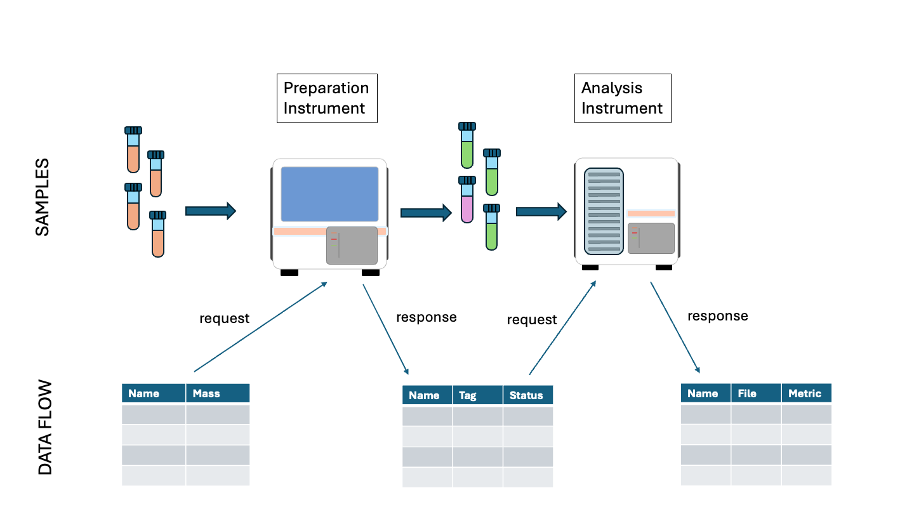
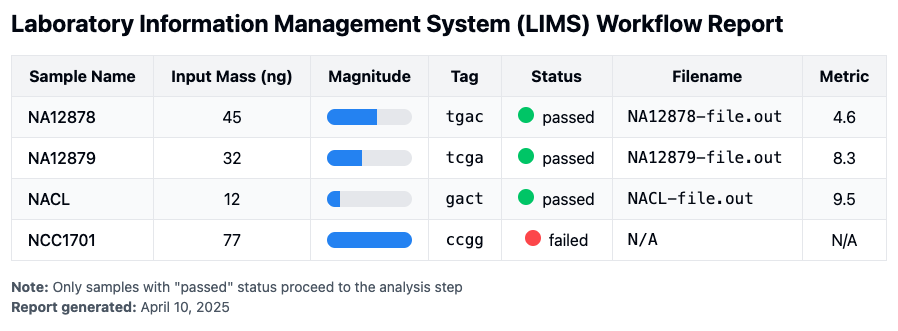

# MCP SERVER LIMS

This repository hosts the MCP Server code that was presented in the video of the following LinkedIn Article.  The example illustrated Anthropic's Claude calling MCP database and simulated-instrument tools to execute the steps of a laboratory workflow.  The example is challenging in that it asks for collections of richly structured data to managed across a number of steps.

[https://www.linkedin.com/pulse/ai-agent-lims-iot-mcp-tom-sheffler-ylmpc/](https://www.linkedin.com/pulse/ai-agent-lims-iot-mcp-tom-sheffler-ylmpc/)


## Introduction


The goal of the LIMS (Laboratory Information Management System) example is for an AI Agent to manage the data associated with a collection of samples as they pass through a laboratory workflow.

The synthetic workflow here is a simplified version of something that you might find in a lab,  but with many details omitted.  In the workflow, there is the passing of physical samples between instruments that process or analyze them.  There is also the data flow associated with the tracking of the samples as they enter an instrument and after they are processed.

The Workflow figure below presents a schematic illustrating the steps of the workflow and the data that must be managed.   Data is illustrated as a table with one entry for each sample at each step.




## Workflow Report generated by Claude


An example output report generated by Claude (with Claude Desktop) is shown below.



A transcript of the conversation with Claude is included for reference.

* [./lims-claude-transcript.docx](./lims-claude-transcript.docx)
* [./lims-claude-transcript.pdf](./lims-claude-transcript.pdf)

## The Example

The workflow begins with the arrival of samples in tubes.  There are some number of tubes.  Each has a "sample name" and an associated "mass".  The data associated with the introduction of the tubes in the lab is entered into the data tracking system.  This step is called "accessioning." 

Now that the samples are registered in the system, they may be processed by the first instrument.  The samples are loaded into the instrument, and the data *about* the samples is also sent to that instrument.  Then the instrument can begin its processing.  This first instrument is called the "preparation" instrument.  Its output consists of two things.

1. the prepared samples in a collection of output tubes
2. data about each of the samples and how it was prepared

In our simulated preparation step, each sample is processed to attach a genetic tag ("actg", "acac", etc.) to the samples in the tube and the tag attached to each sample is noted in the output data.  There is also a note about whether this step was performed successfully or not in the "status" field, which may be "passed" or "failed".

The prepared samples are then ready to be processed in the "analyzer" instrument.  The output samples from the first instrument are loaded into the second instrument and the known data about each of the samples is sent to the analyzer instrument.

The analyzer instrument consumes the phyical samples and emits data about each of the samples analyzed.  Here there is a "filename" and a "metric" measuring a quantity about the analysis step.

The final output of the execution of the workflow should be a report that summarizes information across the steps in an easy to understand format.

## Simulated Instruments

Real laboratory instruments do indeed process data inputs and outputs for collections of samples over protocols like HL7 or REST.  It is possible that such interfaces on real instruments could be integrated with AI Agents as "tools" using MCP (Model Context Protocol).

In this simuluation, rather than calling the APIs of real instruments, the tools here produce simulated results.  The "tag" and "status" values of the preparation instrument are selected randomly, as is the "metric" of the analyzer instrument.

In the real world, the processing of an instrument might require minutes or hours.  In our simulated instruments, we note the passing of time by processing one sample per second.


## Challenges for the AI Agent and Tools Integration

In this example we are asking the AI agent to plan for the management of data across a sequence of steps.  An AI agent may use a database to save intermediate results, and it may find the use of a SQL database useful for preparing a final "join" of the data across the steps.  The Agent might also devise an alternate way of managing data or may simply include it as part of the conversation.

The workflow specification instructs that only the "passing" samples are processed by the analysis step.

We have also defined the tools representing the instruments with an interface with a rich type definition.  Each of the instruments accepts an array-of-structure and produces an array-of-structures.  An example of the MCP definition of "preparation_tool" appears below.

Some notable features of the JSON Schema definition are:

1. the use of named structure "InputSample" in the "$defs" stanza of the JSON
2. the input parameter "sample_list" is an array
3. the array is homogenous with all "items" of type "#/$defs/InputSample"

In our testing so far, many LLMs are able to manage data that fulfills these schema requirements.


``` json
{
 'tools': [{'function': {'description': 'Prepare the samples for analysis.  '
                                        "Mark samples as 'passed' or "
                                        "'failed'. ",
                         'name': 'preparation_tool',
                         'parameters': {
                             '$defs': {
                                 'InputSample': {
                                     'properties': {
                                         'mass': {
                                             'description': 'sample mass in ng',
                                             'title': 'Mass',
                                             'type': 'integer'
                                         },
                                         'sample_name': {
                                             'description': 'sample name identifier',
                                             'title': 'Sample Name',
                                             'type': 'string'
                                         }
                                     },
                                     'required': ['sample_name', 'mass'],
                                     'title': 'InputSample',
                                     'type': 'object'
                                 }
                             },
                             'properties': {
                                 'sample_list': {
                                     'items': {
                                         '$ref': '#/$defs/InputSample'
                                     },
                                     'type': 'array'
                                 }
                             },
                             'required': ['sample_list'],
                             'type': 'object'
                         }
                     },
            'type': 'function'
        }]}
```

## Requirements

In addition to the LIMS Server of this repository, the Python server "mcp-server-sqlite" should be running as well so that the AI Agent can make use of a database.

The source code resides here.

* https://github.com/modelcontextprotocol/servers/tree/main/src/sqlite


## PROMPTS

The first prompt describes the steps of the workflow and how each step is performed by executing a tool.  Since the execution of a tool requires the availability of certain data, the Agent needs to determine how to obtain or produce that data.  The final goal given to the Agent is the production of a Workflow Report that summarizes data across all of the steps.

The beginning of this first prompt is shown below.

```
The assistant's goal is to manage the data associated with a set of samples.  There are four steps of concern.

- accessioning - entering the initial samples in the database
- preparation - calling a tool to process the input samples to attach a tag and monitor a "passed" or "failed" status
- analysis - calling a tool to analyze the outputs of the preparation step whose status is "passed"
- report generation - displaying the sample data across the first 3 steps
...
```


### A smaller tool test for smaller LLMs

The complexity of the first prompt exceeds what smaller LLMs can perform.  A second prompt aims to merely exercies the LLMs ability to format and process a tool call and transform tabular data into the array-of-structures required by the tools.


```
Process the following table of data with the preparation_tool.
<table>
<tr>
  <th>Sample Name</th> <th>Input Mass</th>
<tr>
<tr>
  <td> NA12878 </td> <td> 45 </td>
</tr
<tr>
  <td> NCC1701 </td> <td> 77 </td>
</tr
<tr>
  <td> NACL </td> <td> 12 </td>
</tr
<tr>
  <td> NA12879 </td> <td> 32 </td>
</tr
</table>
```

## How to Build and Run

Make sure you have `uv` installed.

$ git clone https://github.com/sheffler/mcp-server-lims
$ cd mcp-server-lims
$ uv init
$ uv venv
$ uv sync


At this point the dependencies for the MCP server SDK should be installed in the venv.

### Installing for Claude Desktop

Configure Claude Desktop by editing

* ~/Library/Application Support/Claude/claude_desktop_config.json


```
{
  "mcpServers": {
    "mcp-lims-server" : {
      "command": "/Users/sheffler/git/mcp-server-lims/.venv/bin/python",
      "args": [
        "/Users/sheffler/git/mcp-server-lims/lims_server.py"
      ]
    },
    "sqlite": {
      "command": "/Users/sheffler/.local/bin/uvx",
      "args": [
        "mcp-server-sqlite",
        "--db-path",
        "/Users/sheffler/test.db"
      ]
    },
  }
}
```


## Installing for Oterm

~/Library/Application Support/oterm/config.json

```
{"theme": "textual-dark",
 "splash-screen": false,
 "mcpServers": {

    "mcp-lims-server" : {
      "command": "/Users/sheffler/git/mcp-server-lims/.venv/bin/python",
      "args": [
        "/Users/sheffler/git/mcp-server-lims/lims_server.py"
      ]
    },

    "sqlite": {
      "command": "/Users/sheffler/.local/bin/uvx",
      "args": [
        "mcp-server-sqlite",
        "--db-path",
        "/Users/sheffler/test.db"
      ]
    },

 }
}
```
